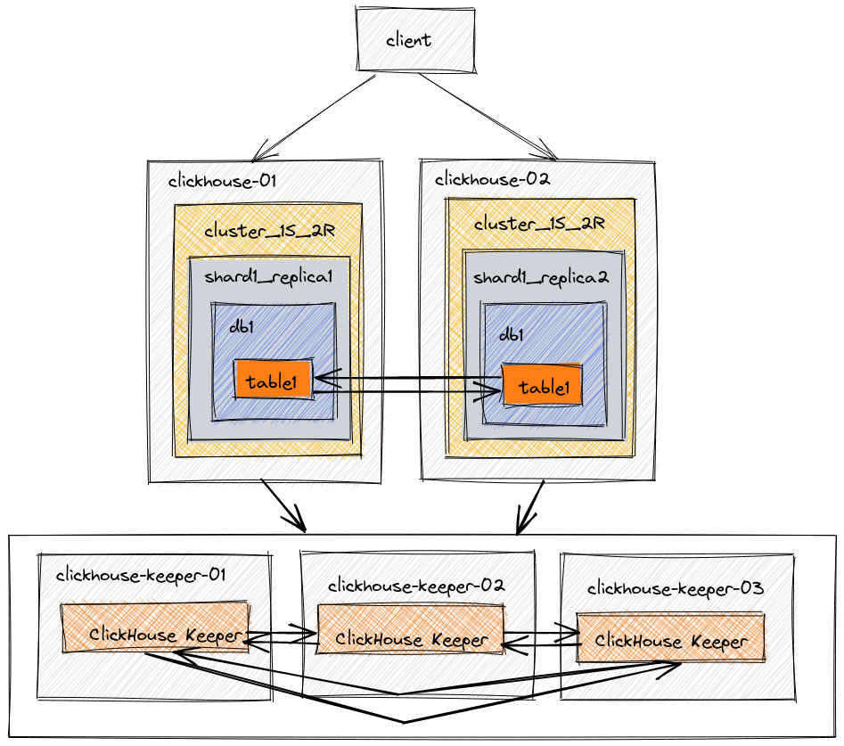

# CloudQuery ClickHouse Terraform Module

## Overview

Installs clickhouse-server and clickhouse-keeper to provide a ClickHouse cluster with replication enabled. Access is via a public-facing NLB. Currently only a single shard is used.

## Architecture

Architecture for a self-hosted clickhouse install supporting [replication](https://clickhouse.com/docs/en/architecture/replication).



## Testing

The following can be used to insert some data for testing purposes. Note the use of `on cluster <cluster-name>` in the database and table creation steps. Clickhouse Cloud abstracts this away from users.

- Create a database

```sql
create database db1 on cluster clickhouse_cluster;
```

- Create a table

```sql
CREATE TABLE db1.table1 ON CLUSTER clickhouse_cluster
(  
`id` UInt64,  
`column1` String  
)  
ENGINE = ReplicatedMergeTree  
ORDER BY id
```

- Insert some data

```sql
INSERT INTO db1.table1 (id, column1) VALUES (1, 'abc');
```

At this stage the data should be present on all nodes of the cluster given that is it configured as a single shard + n replica cluster.

## TODO

- [ ] Add CI/CD for validating and documenting Terraform
- [ ] Add a default user with a password
- [ ] Add certificates to the ClickHouse server
- [ ] Add support for [sharding](https://clickhouse.com/docs/en/architecture/horizontal-scaling)

<!-- BEGIN_TF_DOCS -->
## Requirements

| Name | Version |
|------|---------|
| <a name="requirement_terraform"></a> [terraform](#requirement\_terraform) | >= 0.13 |
| <a name="requirement_aws"></a> [aws](#requirement\_aws) | 5.82.2 |
| <a name="requirement_random"></a> [random](#requirement\_random) | 3.6.3 |
| <a name="requirement_tls"></a> [tls](#requirement\_tls) | ~> 4.0 |

## Providers

| Name | Version |
|------|---------|
| <a name="provider_aws"></a> [aws](#provider\_aws) | 5.82.2 |
| <a name="provider_random"></a> [random](#provider\_random) | 3.6.3 |
| <a name="provider_tls"></a> [tls](#provider\_tls) | ~> 4.0 |

## Modules

| Name | Source | Version |
|------|--------|---------|
| <a name="module_clickhouse_cluster"></a> [clickhouse\_cluster](#module\_clickhouse\_cluster) | terraform-aws-modules/ec2-instance/aws | 5.7.1 |
| <a name="module_clickhouse_keeper"></a> [clickhouse\_keeper](#module\_clickhouse\_keeper) | terraform-aws-modules/ec2-instance/aws | 5.7.1 |
| <a name="module_vpc"></a> [vpc](#module\_vpc) | terraform-aws-modules/vpc/aws | 5.17.0 |

## Resources

| Name | Type |
|------|------|
| [aws_acm_certificate.nlb](https://registry.terraform.io/providers/hashicorp/aws/5.82.2/docs/resources/acm_certificate) | resource |
| [aws_cloudwatch_log_group.clickhouse](https://registry.terraform.io/providers/hashicorp/aws/5.82.2/docs/resources/cloudwatch_log_group) | resource |
| [aws_cloudwatch_log_group.keeper](https://registry.terraform.io/providers/hashicorp/aws/5.82.2/docs/resources/cloudwatch_log_group) | resource |
| [aws_ebs_volume.clickhouse](https://registry.terraform.io/providers/hashicorp/aws/5.82.2/docs/resources/ebs_volume) | resource |
| [aws_ebs_volume.keeper](https://registry.terraform.io/providers/hashicorp/aws/5.82.2/docs/resources/ebs_volume) | resource |
| [aws_iam_instance_profile.clickhouse_cluster_profile](https://registry.terraform.io/providers/hashicorp/aws/5.82.2/docs/resources/iam_instance_profile) | resource |
| [aws_iam_instance_profile.clickhouse_keeper_profile](https://registry.terraform.io/providers/hashicorp/aws/5.82.2/docs/resources/iam_instance_profile) | resource |
| [aws_iam_policy.s3_policy](https://registry.terraform.io/providers/hashicorp/aws/5.82.2/docs/resources/iam_policy) | resource |
| [aws_iam_policy.secrets_access](https://registry.terraform.io/providers/hashicorp/aws/5.82.2/docs/resources/iam_policy) | resource |
| [aws_iam_policy_attachment.s3_policy_attachment](https://registry.terraform.io/providers/hashicorp/aws/5.82.2/docs/resources/iam_policy_attachment) | resource |
| [aws_iam_role.clickhouse_role](https://registry.terraform.io/providers/hashicorp/aws/5.82.2/docs/resources/iam_role) | resource |
| [aws_iam_role_policy_attachment.cw_policy_attachment](https://registry.terraform.io/providers/hashicorp/aws/5.82.2/docs/resources/iam_role_policy_attachment) | resource |
| [aws_iam_role_policy_attachment.kms_policy](https://registry.terraform.io/providers/hashicorp/aws/5.82.2/docs/resources/iam_role_policy_attachment) | resource |
| [aws_iam_role_policy_attachment.secrets_policy](https://registry.terraform.io/providers/hashicorp/aws/5.82.2/docs/resources/iam_role_policy_attachment) | resource |
| [aws_iam_role_policy_attachment.ssm_policy](https://registry.terraform.io/providers/hashicorp/aws/5.82.2/docs/resources/iam_role_policy_attachment) | resource |
| [aws_kms_alias.cloudwatch](https://registry.terraform.io/providers/hashicorp/aws/5.82.2/docs/resources/kms_alias) | resource |
| [aws_kms_key.cloudwatch](https://registry.terraform.io/providers/hashicorp/aws/5.82.2/docs/resources/kms_key) | resource |
| [aws_lb.nlb](https://registry.terraform.io/providers/hashicorp/aws/5.82.2/docs/resources/lb) | resource |
| [aws_lb_listener.clickhouse_nlb_listener](https://registry.terraform.io/providers/hashicorp/aws/5.82.2/docs/resources/lb_listener) | resource |
| [aws_lb_target_group.clickhouse_nlb_target_group](https://registry.terraform.io/providers/hashicorp/aws/5.82.2/docs/resources/lb_target_group) | resource |
| [aws_lb_target_group_attachment.clickhouse_nlb_target_group_attachment](https://registry.terraform.io/providers/hashicorp/aws/5.82.2/docs/resources/lb_target_group_attachment) | resource |
| [aws_route53_record.clickhouse_cluster](https://registry.terraform.io/providers/hashicorp/aws/5.82.2/docs/resources/route53_record) | resource |
| [aws_route53_record.clickhouse_keeper](https://registry.terraform.io/providers/hashicorp/aws/5.82.2/docs/resources/route53_record) | resource |
| [aws_route53_zone.private](https://registry.terraform.io/providers/hashicorp/aws/5.82.2/docs/resources/route53_zone) | resource |
| [aws_s3_bucket.configuration](https://registry.terraform.io/providers/hashicorp/aws/5.82.2/docs/resources/s3_bucket) | resource |
| [aws_s3_bucket.logs](https://registry.terraform.io/providers/hashicorp/aws/5.82.2/docs/resources/s3_bucket) | resource |
| [aws_s3_bucket_logging.configuration](https://registry.terraform.io/providers/hashicorp/aws/5.82.2/docs/resources/s3_bucket_logging) | resource |
| [aws_s3_bucket_public_access_block.configuration](https://registry.terraform.io/providers/hashicorp/aws/5.82.2/docs/resources/s3_bucket_public_access_block) | resource |
| [aws_s3_bucket_public_access_block.logs](https://registry.terraform.io/providers/hashicorp/aws/5.82.2/docs/resources/s3_bucket_public_access_block) | resource |
| [aws_s3_bucket_server_side_encryption_configuration.configuration](https://registry.terraform.io/providers/hashicorp/aws/5.82.2/docs/resources/s3_bucket_server_side_encryption_configuration) | resource |
| [aws_s3_bucket_server_side_encryption_configuration.logs](https://registry.terraform.io/providers/hashicorp/aws/5.82.2/docs/resources/s3_bucket_server_side_encryption_configuration) | resource |
| [aws_s3_bucket_versioning.configuration](https://registry.terraform.io/providers/hashicorp/aws/5.82.2/docs/resources/s3_bucket_versioning) | resource |
| [aws_s3_bucket_versioning.logs](https://registry.terraform.io/providers/hashicorp/aws/5.82.2/docs/resources/s3_bucket_versioning) | resource |
| [aws_s3_object.cluster_cloudwatch_configuration](https://registry.terraform.io/providers/hashicorp/aws/5.82.2/docs/resources/s3_object) | resource |
| [aws_s3_object.cluster_macros](https://registry.terraform.io/providers/hashicorp/aws/5.82.2/docs/resources/s3_object) | resource |
| [aws_s3_object.cluster_network_configuration](https://registry.terraform.io/providers/hashicorp/aws/5.82.2/docs/resources/s3_object) | resource |
| [aws_s3_object.cluster_remote_server_configuration](https://registry.terraform.io/providers/hashicorp/aws/5.82.2/docs/resources/s3_object) | resource |
| [aws_s3_object.cluster_s3_configuration](https://registry.terraform.io/providers/hashicorp/aws/5.82.2/docs/resources/s3_object) | resource |
| [aws_s3_object.cluster_use_keeper_configuration](https://registry.terraform.io/providers/hashicorp/aws/5.82.2/docs/resources/s3_object) | resource |
| [aws_s3_object.cluster_users_configuration](https://registry.terraform.io/providers/hashicorp/aws/5.82.2/docs/resources/s3_object) | resource |
| [aws_s3_object.keeper_cloudwatch_configuration](https://registry.terraform.io/providers/hashicorp/aws/5.82.2/docs/resources/s3_object) | resource |
| [aws_s3_object.keeper_configuration](https://registry.terraform.io/providers/hashicorp/aws/5.82.2/docs/resources/s3_object) | resource |
| [aws_secretsmanager_secret.ca_materials](https://registry.terraform.io/providers/hashicorp/aws/5.82.2/docs/resources/secretsmanager_secret) | resource |
| [aws_secretsmanager_secret.clickhouse_credentials](https://registry.terraform.io/providers/hashicorp/aws/5.82.2/docs/resources/secretsmanager_secret) | resource |
| [aws_secretsmanager_secret.node_certs](https://registry.terraform.io/providers/hashicorp/aws/5.82.2/docs/resources/secretsmanager_secret) | resource |
| [aws_secretsmanager_secret_version.ca_materials](https://registry.terraform.io/providers/hashicorp/aws/5.82.2/docs/resources/secretsmanager_secret_version) | resource |
| [aws_secretsmanager_secret_version.clickhouse_credentials](https://registry.terraform.io/providers/hashicorp/aws/5.82.2/docs/resources/secretsmanager_secret_version) | resource |
| [aws_secretsmanager_secret_version.node_certs](https://registry.terraform.io/providers/hashicorp/aws/5.82.2/docs/resources/secretsmanager_secret_version) | resource |
| [aws_security_group.clickhouse_cluster](https://registry.terraform.io/providers/hashicorp/aws/5.82.2/docs/resources/security_group) | resource |
| [aws_security_group.clickhouse_keeper](https://registry.terraform.io/providers/hashicorp/aws/5.82.2/docs/resources/security_group) | resource |
| [aws_security_group.nlb](https://registry.terraform.io/providers/hashicorp/aws/5.82.2/docs/resources/security_group) | resource |
| [aws_security_group_rule.clickhouse_cluster_ingress](https://registry.terraform.io/providers/hashicorp/aws/5.82.2/docs/resources/security_group_rule) | resource |
| [aws_security_group_rule.clickhouse_from_nlb](https://registry.terraform.io/providers/hashicorp/aws/5.82.2/docs/resources/security_group_rule) | resource |
| [aws_security_group_rule.clickhouse_health_check](https://registry.terraform.io/providers/hashicorp/aws/5.82.2/docs/resources/security_group_rule) | resource |
| [aws_security_group_rule.clickhouse_interserver](https://registry.terraform.io/providers/hashicorp/aws/5.82.2/docs/resources/security_group_rule) | resource |
| [aws_security_group_rule.clickhouse_keeper_access](https://registry.terraform.io/providers/hashicorp/aws/5.82.2/docs/resources/security_group_rule) | resource |
| [aws_security_group_rule.clickhouse_outbound](https://registry.terraform.io/providers/hashicorp/aws/5.82.2/docs/resources/security_group_rule) | resource |
| [aws_security_group_rule.clickhouse_prometheus](https://registry.terraform.io/providers/hashicorp/aws/5.82.2/docs/resources/security_group_rule) | resource |
| [aws_security_group_rule.cluster_ssh](https://registry.terraform.io/providers/hashicorp/aws/5.82.2/docs/resources/security_group_rule) | resource |
| [aws_security_group_rule.keeper_cluster_access](https://registry.terraform.io/providers/hashicorp/aws/5.82.2/docs/resources/security_group_rule) | resource |
| [aws_security_group_rule.keeper_outbound](https://registry.terraform.io/providers/hashicorp/aws/5.82.2/docs/resources/security_group_rule) | resource |
| [aws_security_group_rule.keeper_raft](https://registry.terraform.io/providers/hashicorp/aws/5.82.2/docs/resources/security_group_rule) | resource |
| [aws_security_group_rule.keeper_ssh](https://registry.terraform.io/providers/hashicorp/aws/5.82.2/docs/resources/security_group_rule) | resource |
| [aws_security_group_rule.nlb_inbound](https://registry.terraform.io/providers/hashicorp/aws/5.82.2/docs/resources/security_group_rule) | resource |
| [aws_security_group_rule.nlb_to_clickhouse](https://registry.terraform.io/providers/hashicorp/aws/5.82.2/docs/resources/security_group_rule) | resource |
| [aws_volume_attachment.clickhouse](https://registry.terraform.io/providers/hashicorp/aws/5.82.2/docs/resources/volume_attachment) | resource |
| [aws_volume_attachment.keeper](https://registry.terraform.io/providers/hashicorp/aws/5.82.2/docs/resources/volume_attachment) | resource |
| [random_password.admin_user](https://registry.terraform.io/providers/hashicorp/random/3.6.3/docs/resources/password) | resource |
| [random_password.cluster_secret](https://registry.terraform.io/providers/hashicorp/random/3.6.3/docs/resources/password) | resource |
| [random_password.default_user](https://registry.terraform.io/providers/hashicorp/random/3.6.3/docs/resources/password) | resource |
| [tls_cert_request.cluster](https://registry.terraform.io/providers/hashicorp/tls/latest/docs/resources/cert_request) | resource |
| [tls_cert_request.keeper](https://registry.terraform.io/providers/hashicorp/tls/latest/docs/resources/cert_request) | resource |
| [tls_cert_request.nlb](https://registry.terraform.io/providers/hashicorp/tls/latest/docs/resources/cert_request) | resource |
| [tls_locally_signed_cert.cluster](https://registry.terraform.io/providers/hashicorp/tls/latest/docs/resources/locally_signed_cert) | resource |
| [tls_locally_signed_cert.keeper](https://registry.terraform.io/providers/hashicorp/tls/latest/docs/resources/locally_signed_cert) | resource |
| [tls_locally_signed_cert.nlb](https://registry.terraform.io/providers/hashicorp/tls/latest/docs/resources/locally_signed_cert) | resource |
| [tls_private_key.ca](https://registry.terraform.io/providers/hashicorp/tls/latest/docs/resources/private_key) | resource |
| [tls_private_key.cluster](https://registry.terraform.io/providers/hashicorp/tls/latest/docs/resources/private_key) | resource |
| [tls_private_key.keeper](https://registry.terraform.io/providers/hashicorp/tls/latest/docs/resources/private_key) | resource |
| [tls_private_key.nlb](https://registry.terraform.io/providers/hashicorp/tls/latest/docs/resources/private_key) | resource |
| [tls_self_signed_cert.ca](https://registry.terraform.io/providers/hashicorp/tls/latest/docs/resources/self_signed_cert) | resource |
| [aws_ami.ubuntu](https://registry.terraform.io/providers/hashicorp/aws/5.82.2/docs/data-sources/ami) | data source |
| [aws_availability_zones.available](https://registry.terraform.io/providers/hashicorp/aws/5.82.2/docs/data-sources/availability_zones) | data source |
| [aws_caller_identity.current](https://registry.terraform.io/providers/hashicorp/aws/5.82.2/docs/data-sources/caller_identity) | data source |
| [aws_region.current](https://registry.terraform.io/providers/hashicorp/aws/5.82.2/docs/data-sources/region) | data source |

## Inputs

| Name | Description | Type | Default | Required |
|------|-------------|------|---------|:--------:|
| <a name="input_admin_user_networks"></a> [admin\_user\_networks](#input\_admin\_user\_networks) | List of networks allowed to connect as admin user | `list(string)` | <pre>[<br/>  "::/0"<br/>]</pre> | no |
| <a name="input_allowed_cidr_blocks"></a> [allowed\_cidr\_blocks](#input\_allowed\_cidr\_blocks) | List of CIDR blocks allowed to access the ClickHouse cluster | `list(string)` | <pre>[<br/>  "0.0.0.0/0"<br/>]</pre> | no |
| <a name="input_clickhouse_instance_type"></a> [clickhouse\_instance\_type](#input\_clickhouse\_instance\_type) | The instance type for the ClickHouse servers | `string` | `"t2.medium"` | no |
| <a name="input_clickhouse_volume_size"></a> [clickhouse\_volume\_size](#input\_clickhouse\_volume\_size) | The size of the EBS volume for the ClickHouse servers in GB | `number` | `10` | no |
| <a name="input_clickhouse_volume_type"></a> [clickhouse\_volume\_type](#input\_clickhouse\_volume\_type) | The type of EBS volume for the ClickHouse servers | `string` | `"gp2"` | no |
| <a name="input_cluster_domain"></a> [cluster\_domain](#input\_cluster\_domain) | Domain name for the cluster (used for certificates) | `string` | `""` | no |
| <a name="input_cluster_name"></a> [cluster\_name](#input\_cluster\_name) | The name of the ClickHouse cluster | `string` | `"clickhouse"` | no |
| <a name="input_default_user_networks"></a> [default\_user\_networks](#input\_default\_user\_networks) | List of networks allowed to connect as default user | `list(string)` | <pre>[<br/>  "::/0"<br/>]</pre> | no |
| <a name="input_enable_encryption"></a> [enable\_encryption](#input\_enable\_encryption) | Enable TLS encryption for all ClickHouse communication | `bool` | `false` | no |
| <a name="input_enable_nlb"></a> [enable\_nlb](#input\_enable\_nlb) | Enable the Network Load Balancer for the ClickHouse cluster | `bool` | `true` | no |
| <a name="input_enable_nlb_tls"></a> [enable\_nlb\_tls](#input\_enable\_nlb\_tls) | Enable TLS termination at the NLB. Requires either an existing certificate ARN or cluster encryption to be enabled | `bool` | `false` | no |
| <a name="input_external_ca_cert"></a> [external\_ca\_cert](#input\_external\_ca\_cert) | PEM-encoded CA certificate for cluster communication. Required if use\_external\_certs is true | `string` | `""` | no |
| <a name="input_external_cert_secret_ids"></a> [external\_cert\_secret\_ids](#input\_external\_cert\_secret\_ids) | Map of Secret Manager ARNs containing certificates and private keys for each node. Required if use\_external\_certs is true | <pre>object({<br/>    cluster_nodes = map(string) # Map of node name to Secrets Manager ARN containing certificate and private key<br/>    keeper_nodes  = map(string)<br/>  })</pre> | `null` | no |
| <a name="input_http_port"></a> [http\_port](#input\_http\_port) | HTTP default port | `number` | `8123` | no |
| <a name="input_https_port"></a> [https\_port](#input\_https\_port) | HTTPS default port | `number` | `8443` | no |
| <a name="input_interserver_http_port"></a> [interserver\_http\_port](#input\_interserver\_http\_port) | Inter-server communication port | `number` | `9009` | no |
| <a name="input_interserver_https_port"></a> [interserver\_https\_port](#input\_interserver\_https\_port) | SSL/TLS port for inter-server communications | `number` | `9010` | no |
| <a name="input_keeper_instance_type"></a> [keeper\_instance\_type](#input\_keeper\_instance\_type) | The instance type for the ClickHouse keepers | `string` | `"t2.medium"` | no |
| <a name="input_keeper_node_count"></a> [keeper\_node\_count](#input\_keeper\_node\_count) | The number of ClickHouse keepers to deploy | `number` | `3` | no |
| <a name="input_keeper_port"></a> [keeper\_port](#input\_keeper\_port) | ClickHouse Keeper port | `number` | `9181` | no |
| <a name="input_keeper_port_secure"></a> [keeper\_port\_secure](#input\_keeper\_port\_secure) | Secure SSL ClickHouse Keeper port | `number` | `9281` | no |
| <a name="input_keeper_raft_port"></a> [keeper\_raft\_port](#input\_keeper\_raft\_port) | ClickHouse Keeper Raft port | `number` | `9234` | no |
| <a name="input_keeper_volume_size"></a> [keeper\_volume\_size](#input\_keeper\_volume\_size) | The size of the EBS volume for the ClickHouse keepers in GB | `number` | `10` | no |
| <a name="input_keeper_volume_type"></a> [keeper\_volume\_type](#input\_keeper\_volume\_type) | The type of EBS volume for the ClickHouse keepers | `string` | `"gp2"` | no |
| <a name="input_key_name"></a> [key\_name](#input\_key\_name) | Name of an AWS key pair to use for SSH access (must exist in the AWS account) | `string` | `""` | no |
| <a name="input_nlb_type"></a> [nlb\_type](#input\_nlb\_type) | Type of NLB to create - internal or external | `string` | `"internal"` | no |
| <a name="input_prometheus_port"></a> [prometheus\_port](#input\_prometheus\_port) | Prometheus metrics port | `number` | `9363` | no |
| <a name="input_region"></a> [region](#input\_region) | The AWS region to deploy to | `string` | n/a | yes |
| <a name="input_retention_period"></a> [retention\_period](#input\_retention\_period) | Log retention period in days | `number` | `30` | no |
| <a name="input_shards"></a> [shards](#input\_shards) | List of shards and their configuration. Each shard specifies how many replicas it should have and optionally its weight. | <pre>list(object({<br/>    replica_count = number<br/>    weight        = optional(number, 1)<br/>  }))</pre> | n/a | yes |
| <a name="input_ssh_access"></a> [ssh\_access](#input\_ssh\_access) | SSH access configuration. Set enabled=false to disable SSH access, or configure cidr\_blocks for access control. | <pre>object({<br/>    enabled = bool<br/>    # cidr_blocks can be null to use VPC CIDR, or a list of explicit CIDRs<br/>    cidr_blocks = list(string)<br/>    # if true, adds VPC CIDR to the provided cidr_blocks<br/>    include_vpc_cidr = bool<br/>  })</pre> | <pre>{<br/>  "cidr_blocks": [],<br/>  "enabled": false,<br/>  "include_vpc_cidr": true<br/>}</pre> | no |
| <a name="input_ssl_cert_days"></a> [ssl\_cert\_days](#input\_ssl\_cert\_days) | Validity period for self-signed certificates in days | `number` | `365` | no |
| <a name="input_ssl_key_bits"></a> [ssl\_key\_bits](#input\_ssl\_key\_bits) | Key size for self-signed certificates | `number` | `2048` | no |
| <a name="input_tags"></a> [tags](#input\_tags) | Tags to apply to all resources | `map(string)` | <pre>{<br/>  "Environment": "production",<br/>  "ManagedBy": "terraform"<br/>}</pre> | no |
| <a name="input_tcp_port"></a> [tcp\_port](#input\_tcp\_port) | Native Protocol port for client-server communication | `number` | `9000` | no |
| <a name="input_tcp_port_secure"></a> [tcp\_port\_secure](#input\_tcp\_port\_secure) | Native protocol SSL/TLS port | `number` | `9440` | no |
| <a name="input_tls_certificate_arn"></a> [tls\_certificate\_arn](#input\_tls\_certificate\_arn) | ARN of an existing ACM certificate to use for NLB TLS termination. Required if enable\_nlb\_tls is true and using an existing certificate | `string` | `""` | no |
| <a name="input_use_external_certs"></a> [use\_external\_certs](#input\_use\_external\_certs) | Use externally provided certificates instead of generating them | `bool` | `false` | no |
| <a name="input_use_generated_cert"></a> [use\_generated\_cert](#input\_use\_generated\_cert) | Use the cluster's generated CA to create a certificate for the NLB. Requires enable\_encryption to be true | `bool` | `false` | no |

## Outputs

| Name | Description |
|------|-------------|
| <a name="output_ca_secret_arn"></a> [ca\_secret\_arn](#output\_ca\_secret\_arn) | Output the Secret ARN for use in user\_data |
| <a name="output_clickhouse_cluster_ips"></a> [clickhouse\_cluster\_ips](#output\_clickhouse\_cluster\_ips) | Output the public and private IP addresses of the ClickHouse cluster |
| <a name="output_clickhouse_keeper_ips"></a> [clickhouse\_keeper\_ips](#output\_clickhouse\_keeper\_ips) | Output the public and private IP addresses of the ClickHouse keepers |
| <a name="output_clickhouse_nlb_dns"></a> [clickhouse\_nlb\_dns](#output\_clickhouse\_nlb\_dns) | Output the DNS name of the NLB |
<!-- END_TF_DOCS -->
